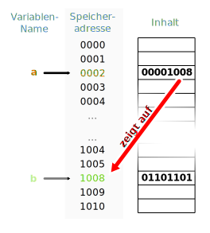

# Thema des Kapitels

## Inhalt 1
<details>
  <summary>Ich bin ein Akkordion, Clicke mich</summary>
  
  Hier ein Beispiel für eine nested Liste:

- bla bla bla 
  - bla bla bla
  - bla bla bla
    * bla bla bla
  - bla bla bla
- bla bla bla
- bla bla bla

Hier ein Beispiel für eine Tabelle:

| Java | C#    |
| ---- | ----- |
| Test | Test  |
| Test | Test  |
| Test | Test  |
| Test | Test  |

</details>


## Inhalt 2

Hier ein Beispiel für ein Bild:

 

### Code-Beispiele

Code-Beispiele müssen nicht zwingend in einem eigenen Kapitel sein. Sie können auch durchaus im Inhalt sein.

<details open>
<summary>
  
  #### Java</summary>

```Java
class Simple {
  public static void main(String args[]) {
    System.out.println("Hello Java");
  }
}
```
</details>

<details>
<summary>
  
  #### C#</summary>
  
```c#
class Simple {  
  public static void Main(String args[]) {  
    Console.WriteLine("Hello C#");  
  }  
}
```
</details>

# Kapitel 2

Hier ein Verweis auf den [2. Kapitel](chapter2.md)

# Referenzen

Hier kommt eine Liste von Links zu weiterführenden Inhalten (zB spezifische Inhalte, worauf man speziell achten muss, oder Inhalte, welche sich die Teilnehmer nur optional anschauen)

# Aufgaben/Übungen

Hier kommt die Angabe zur jeweiligen Aufgabe/Übung

Zurück zur [Startseite](README.md)
