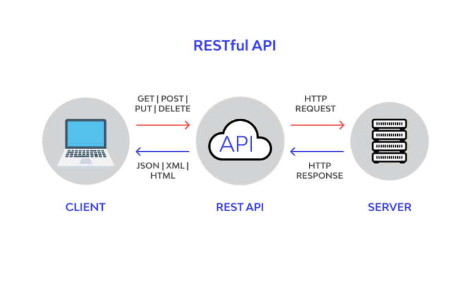

# What is REST?
Before we get into REST and what it actually is, we must first define two important terms:

- **Client:**
    - In the context of a REST API, a client is any software application or system that makes requests to the API to access resources or perform actions.
    - The client initiates communication with the API by sending HTTP requests, typically using methods like GET, POST, PUT, DELETE, etc.
    - Clients can be web browsers, mobile apps, desktop applications, servers, or any other software capable of sending HTTP requests.
    - Clients interact with the API based on the endpoints provided by the API, which represent different resources or actions that can be accessed.
    - The API responds to client requests with HTTP responses, typically in formats like JSON or XML, containing the requested data or indicating the success or failure of the request.
    - Clients are responsible for handling the API responses and processing the data returned by the API to provide the desired functionality or user experience.

- **Resource:**
    - In a REST API, a resource is any information or data that can be accessed or manipulated through the API.
    - Resources are typically represented by URLs (Uniform Resource Locators), also known as endpoints, which uniquely identify them.
    - Examples of resources include user profiles, blog posts, images, products, or any other data entity that the API provides access to.
    - Each resource has its own unique URL, which allows clients to interact with it by sending HTTP requests to that URL.
    - REST APIs use standard HTTP methods (GET, POST, PUT, DELETE, etc.) to perform actions on resources, such as retrieving, creating, updating, or deleting them.
    - The data associated with a resource is typically returned to the client in a standardized format, such as JSON or XML, in the HTTP response.
    - Resources in a REST API adhere to the principles of statelessness, meaning that each request from the client contains all the information necessary for the server to fulfill the request, without relying on previous interactions.

**REST stands for REpresentational State Transfer.**
It means when a RESTful API is called, the server will transfer to the client a representation of the state of the requested resource.

What the server does when you, the client, call one of its APIs depends on 2 things that you need to provide to the server:
- An identifier for the resource you are interested in. This is the URL for the resource, also known as the endpoint. In fact, URL stands for Uniform Resource Locator.
- The operation you want the server to perform on that resource, in the form of an HTTP method, or verb. The common HTTP methods are GET, POST, PUT, and DELETE.
The image below shows the typical communictation between client & REST-API, REST-API and server.

## The communication in a RESTful API works like this:

### Communication between Client and REST API:

- The client initiates communication by sending HTTP requests to the REST API.
- These requests typically include the desired action (e.g., GET for retrieving data, POST for creating data) and any necessary parameters or data.
- The REST API receives the request and processes it based on the specified endpoint (resource) and HTTP method.
- The API then interacts with the server, if needed, to retrieve or manipulate the requested data.
- Once the data is ready, the API sends an HTTP response back to the client, containing the requested data or indicating the result of the operation (success or failure).

### Communication between REST API and Server:

- The REST API acts as an intermediary between the client and the server, handling incoming requests and outgoing responses.
- When the API receives a request from the client, it may need to interact with the server to fulfill the request.
- This interaction with the server could involve querying a database, accessing other services, or performing any necessary business logic.
- Once the server-side processing is complete, the API gathers the relevant data or results and prepares an appropriate HTTP response to send back to the client.
- The API abstracts the details of server-side processing from the client, providing a standardized interface for accessing and manipulating data.

### Additional Learning Material:
- REST & API'S explained https://www.youtube.com/watch?v=-mN3VyJuCjM
- LinkedIn Learning Course on APIS: https://www.linkedin.com/learning/learning-rest-apis/welcome?u=68130610
- Job Interview Questions about REST: https://www.youtube.com/watch?v=faMdrSCVDzc
